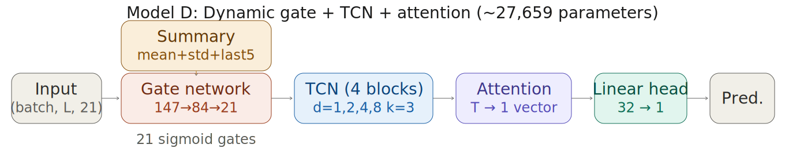
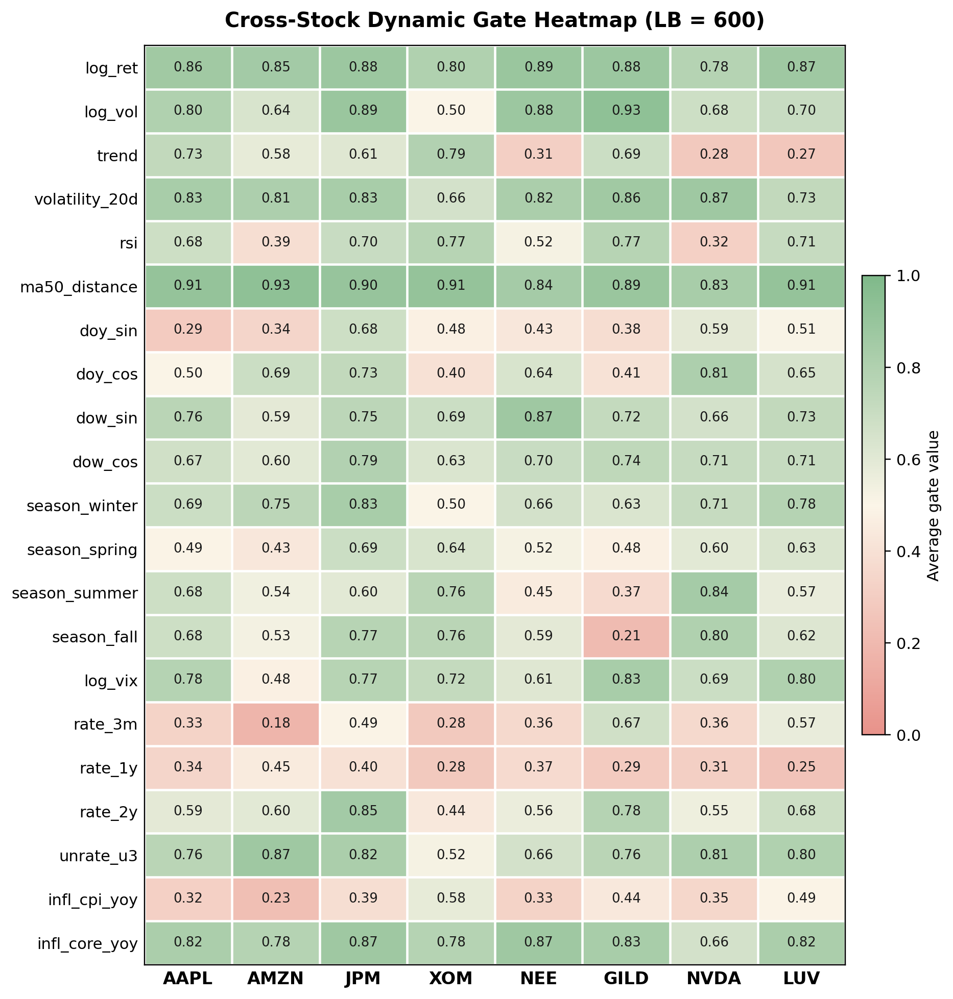
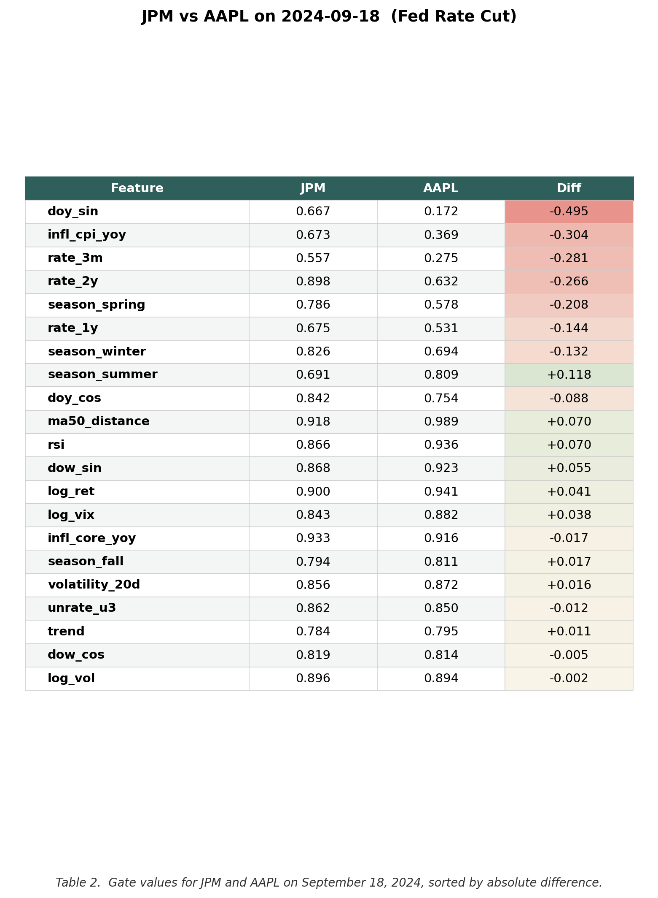
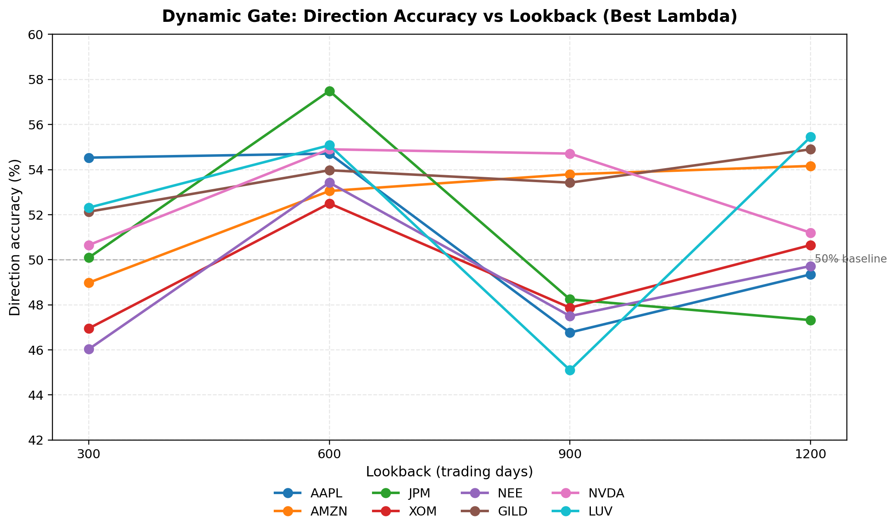
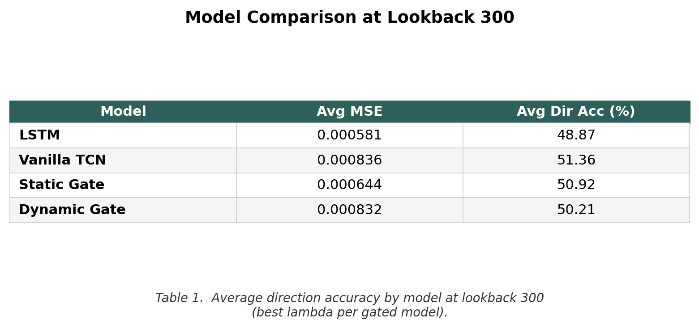

# Explainable AI Through Dynamic Feature Gating in Temporal Convolutional Networks for Stock Price Prediction

Master's thesis, University of Colorado Denver, 2026
**Author:** Michael McGrath &nbsp;•&nbsp; **Advisor:** Gita Alaghband

## Overview

Deep learning models predict stock prices well but offer no insight into *why* a given prediction was made — a problem in any domain that requires transparency (compliance, risk oversight, regulated trading). Post-hoc methods like SHAP and WindowSHAP give feature attributions after the fact, but at a steep cost: Nori et al. (2023) report roughly 90 GB of RAM and tens of thousands of CPU-seconds per explained sample on datasets smaller than the one used here.

This thesis proposes **dynamic feature gating** as a built-in alternative. A small auxiliary network reads a summary of each input window and outputs a per-window sigmoid gate value between 0 and 1 for each of the 21 input features. Those gate values scale the input before it enters the prediction model *and* double as real-time feature-importance scores — no separate post-hoc computation needed.

## Architecture

The proposed model (**Model D**) combines a Temporal Convolutional Network backbone with temporal attention and the dynamic feature gate:



Three comparison models are evaluated alongside it: an LSTM baseline (Model A), a vanilla TCN with attention (Model B), and a TCN with attention plus a *static* feature gate (Model C). All four share the same data pipeline, hyperparameters, and evaluation protocol.

| File | Model | Description | Parameters |
|------|-------|-------------|-----------:|
| `model_a_lstm.py` | Model A | LSTM baseline | 7,073 |
| `model_b_vanilla_tcn.py` | Model B | TCN + temporal attention | 13,442 |
| `model_c_static_gate.py` | Model C | TCN + attention + static feature gate | 13,463 |
| `model_d_dynamic_gate.py` | Model D | TCN + attention + dynamic feature gate | 27,659 |

## Results

### Cross-stock feature importance

The dynamic gate produces a 21-dimensional feature importance vector for every test window. Averaged across all test windows, the per-stock gate values reveal a structured, sector-consistent pattern:



Some features are consistently important across all eight stocks (`ma50_distance`, `log_ret`). Others vary substantially — `trend`, `rsi`, `rate_3m`, and `season_fall` all show wide cross-stock variation, consistent with Neely et al.'s (2014) finding that different predictor types carry different information depending on the asset.

### Case study: Federal Reserve rate cut (JPM vs AAPL)

On September 18, 2024, the Fed cut rates by 50 basis points — its first cut since March 2020. The gate's treatment of rate-related features on that date shows a clear sector-consistent pattern, **without the model having been told which stock is a bank**:



The gate assigned roughly 2× the weight to rate features for JPM (a bank) than for AAPL (a consumer tech firm). Non-rate features showed minimal differences, confirming the gate is differentiating selectively by feature — not assigning uniformly higher weights to one stock across the board.

### Lookback sensitivity

Dynamic gate direction accuracy varies considerably with window length. Lookback 600 produced the best results for five of eight stocks:



### Model comparison

At lookback 300, averaged across eight stocks (best lambda per gated model):



Feature gating introduces a small accuracy cost (≈1 percentage point vs. the vanilla TCN) in exchange for per-window feature attribution at zero additional inference cost.

## Repository structure

```
data_pipeline.py         Feature engineering: OHLCV + macro + seasonality -> 21 features, windowed
model_a_lstm.py          Model A: LSTM baseline
model_b_vanilla_tcn.py   Model B: TCN + temporal attention
model_c_static_gate.py   Model C: TCN + attention + static feature gate
model_d_dynamic_gate.py  Model D: TCN + attention + dynamic feature gate (main contribution)
run_all_configs.py       Experiment runner: all tickers x lookbacks x lambdas -> results + dashboard
results/                 Sample run outputs, figures, HTML dashboard
```

## Features

The 21 input features span four categories:

- **Price-derived (3):** log return, log volume, trend (EMA20 − EMA60)
- **Technical (3):** 20-day rolling volatility, RSI, 50-day moving-average distance
- **Macroeconomic (7):** log VIX, 3-month / 1-year / 2-year treasury rates, unemployment rate, headline CPI, core CPI
- **Temporal (8):** day-of-year sin/cos, day-of-week sin/cos, four binary season indicators

## Experimental configuration

- **Tickers:** AAPL, AMZN, JPM, XOM, NEE, GILD, NVDA, LUV
- **Date range:** January 2015 to January 2026
- **Lookback windows:** 300, 600, 900, 1200 trading days
- **Sparsity lambdas:** 0, 0.0001, 0.001
- **Train / test split:** 80 / 20 chronological
- **Hyperparameters:** seed 42, 100 epochs, learning rate 1e-3, batch size 128, hidden dim 32

## Usage

Run all experiments:

```bash
python run_all_configs.py
```

This produces a timestamped results text file and an HTML dashboard with per-date gate value lookup.

Run a single model standalone:

```bash
python model_d_dynamic_gate.py
```

The default ticker and lookback are configured in `data_pipeline.py`.

## Requirements

- Python 3.9+
- PyTorch
- NumPy
- pandas
- yfinance
- dbnomics (for macroeconomic data)

## Hardware

Experiments were run on an NVIDIA RTX 4080 Laptop GPU. CPU training is possible but significantly slower for longer lookback windows.
